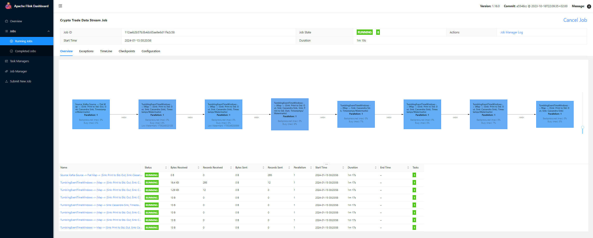

# ChartDataPipeline

This project is a data pipeline to aggregate tick data to candlestick.

## What it do


Receive data from [Crypto.com Exchange API](https://exchange-docs.crypto.com/exchange/v1/rest-ws/index.html#introduction) and process the trade data into different timeframe candlestick.

## How it work

### Data Source
Data is received from Crypto.com Websocket API which it will provide real time trade data.

Data format:
```
{
  "id": 1,
  "method": "subscribe",
  "code": 0,
  "result": {
    "instrument_name": "BTCUSD-PERP",
    "subscription": "trade.BTCUSD-PERP",
    "channel": "trade",
    "data": [{
      "d" : "2030407068",    // Trade ID
      "t": 1613581138462,    // Trade time
      "p": "51327.500000",   // Price
      "q": "0.000100",       // Quantity
      "s": "SELL",           // Side
      "i": "BTCUSD-PERP"     // Instrument name
    }]
  }
}
```

### Data Processing
Data is processed into candlestick (shown below) using Window operator (TumblingEventTimeWindows) with window size of 
1 min, 5 min, 15 min, 30 min, 1 hour, 4 hours and 1 day.

```
{
  "symbol": "XRP_USDT",
  "timestamp": 1613581138462, // Candle time
  "open": 0.505,
  "high": 0.554,
  "low": 0.490,
  "close": 0.535,
  "volume": 1
}
```

#### Window Trigger
The default trigger for TumblingEventTimeWindows are EventTimeTrigger. However, for this use case the candle should be 
processed immediately whenever the window max timestamp is reached. So, the trigger is modified to ProcessingTimeTrigger.

For the subsequence window function, ProcessingTimeTrigger does not suit the use case because it may fire the window twice
when it reach the timestamp because window are process sequentially so when the window fire for first time the latest result of 
previous window is not ready. So custom trigger function is used where if the EventTime pass the window max timestamp it 
will fire. For implementation detail please refer to [CandleTrigger.java](flink/flink-processing/src/main/java/marketdata/trigger/CandleTrigger.java).

#### Window Process Function
Due to the possible of late data, a window may get triggered multiple time results in downstream task to receive multiple 
result of the same period candle. So before constructing the candlestick duplicate timeframe candle is removed will preserving 
the latest processed data. For implementation detail please refer to [AggCandleFunction.java](flink/flink-processing/src/main/java/marketdata/function/AggCandleFunction.java).

## Screenshot


## Some problem/improvement
1. The job maybe can be refactor into non keyed stream (each trade symbol one kafka topic and flink job) to reduce the triggering of keyBy function.


[//]: # (## In Progress / Plan)

[//]: # ()
[//]: # ([//]: # &#40;1. Add documentation/screenshot about the flink jobs UI &#41;)
[//]: # (2. Using python script to get Crypto.com api daily batch job )

[//]: # (3. ML model for giving trade signal)

[//]: # (4. Test file for jobs )

[//]: # (5. Research more on the M1 trigger function )

[//]: # (6. Do Flink ML)

