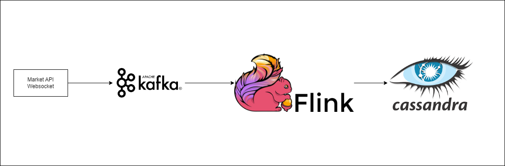

# ChartDataPipeline

This project is a data pipeline to aggregate tick data to candlestick.

## What it do

Receive data from Crypto.com API and process the trade data into different timeframe candlestick.

[//]: # (## In Progress / Plan)

[//]: # (1. Using python script to get Crypto.com api daily batch job)

[//]: # (2. ML model for giving trade signal)

[//]: # ()
[//]: # ()
[//]: # (## Project Screenshot)

[//]: # ()
[//]: # ()
[//]: # (## Setup )

[//]: # ()
[//]: # ()
[//]: # (## Reflection)

